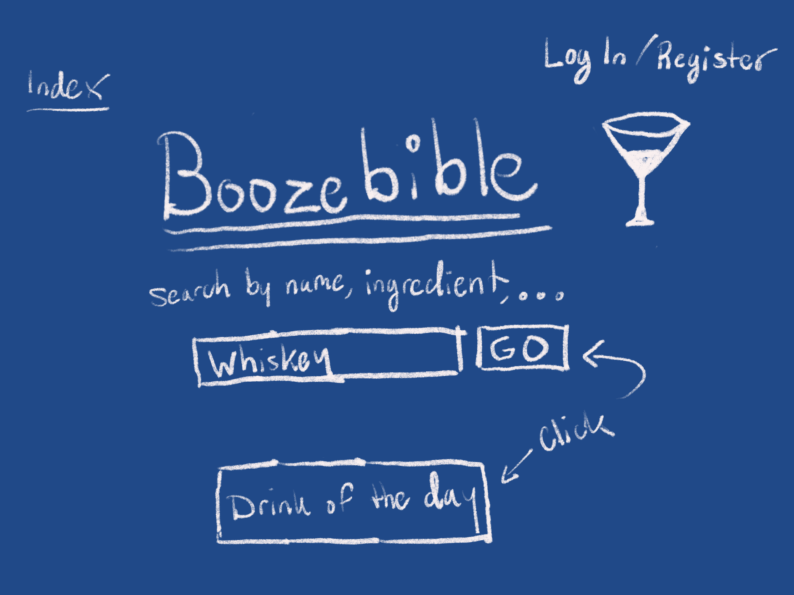
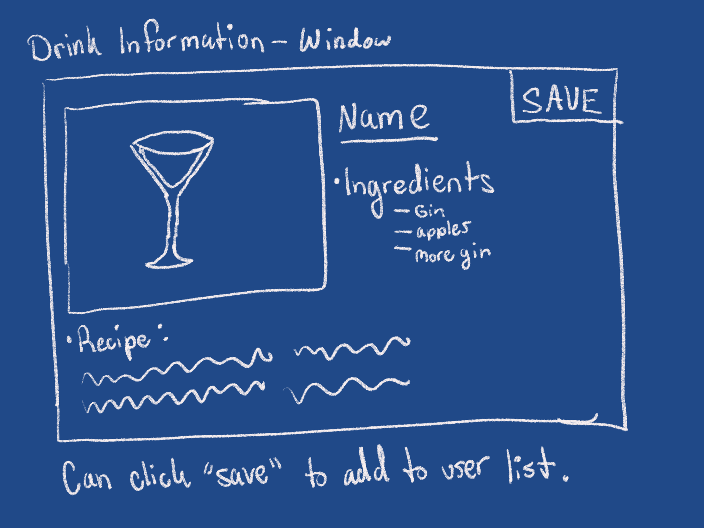
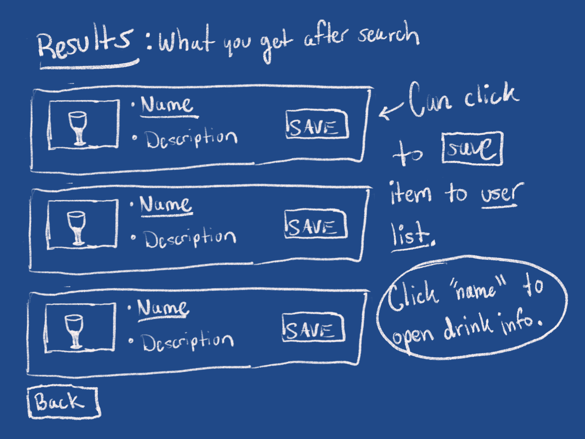

## Welcome to Boozebible!

*** Danny Graugnard / December 5th, 2017 ***

## What is Boozebible?

Ever thought to yourself, "what can I make with celery and pickle juice into something boozy?" The answer to this problem is Boozebible!

With Boozebible, easily search an extensive cocktail API by name or just that batch of tomatoes you so desperately want to get rid of. You can even keep a list of favorite cocktails that you can add, update, or delete.

## Wireframe

## Wins
It was helpful to build and app using an API from scratch. Backend development for me was difficult for me to see how everything works together, however building these apps and figuring out errors on my own have helped understand the subject matter.

## Struggle
I need to find a better work flow when building this thing. I underestimated the usefulness of "The Chart," and have code scattered throughout the MVC. For this reason I have bugs and cannot create or update.

## Sources
1. Cocktail API: http://www.thecocktaildb.com/api.php
2. Quotes API built in class
3. Image from Empire Hotel
